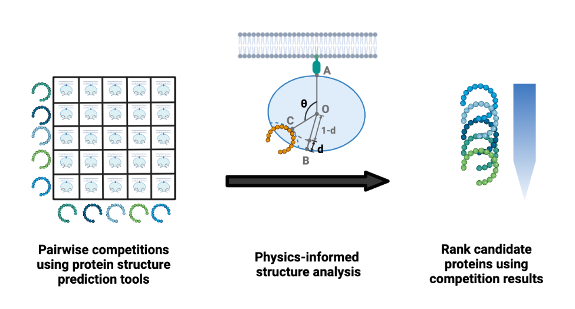

# APPRAISE: Rank binders by structure modeling

***A***utomated ***P***air-wise ***P***eptide-***R***eceptor binding model ***A***nalys***I***s for ***S***creening ***E***ngineered proteins (***APPRAISE***) is a method that predicts the receptor binding propensity of engineered proteins based on high-precision protein structure prediction tools, such as AlphaFold2-multimer. The APPRAISE Python package includes tools for preparing input files and analyzing the modeled structures.



Author: Xiaozhe Ding (Email: dingxiaozhe@gmail.com, xding@caltech.edu; Twitter: [@DingXiaozhe](https://twitter.com/dingxiaozhe?lang=en))

## Getting started without installation

We recommend using APPRAISE remotely by running Colab-APPRAISE notebook on Google Colaboratory, which allows you to access APPRAISE with a **web-based interface**. This notebook guides users through the APPRAISE process step-by-step, with results stored on Google Drive. No need for a local installation when using this notebook.

The basic service of Google Colaboratory is free, although you can choose paid plans to get more stable access to better hardwares.

**How to run Colab-APPRAISE**
1. [Open Colab-APPRAISE notebook in Google Colaboratory](https://colab.research.google.com/github/xz-ding/APPRAISE/blob/main/Colab_APPRAISE.ipynb);
2. Go to "File --> save a copy in Drive" to save a copy of your own;
3. Follow the Quick guide on the top of the notebook, and you can start APPRAISing!

## Local installation

### Environment

Local APPRAISE 1.2 was tested with the following environment:

 - MacOS 10.14.6

 - Python 3.6.10

 - Alphafold-colabfold 2.1.14 (Available [here](https://github.com/sokrypton/ColabFold))

 - PyMOL 2.3.3 (Schrodinger LLC.)

 - Python packages:

    - scipy 1.4.1

    - numpy 1.18.2

    - pandas 1.1.5

    - matplotlib 3.2.1

    - seaborn 0.11.2


### Installation options

Installation of APPRAISE locally requires pip. In most cases, pip comes with your Python environment. If not, you can [follow the instructions here to install pip](https://pip.pypa.io/en/stable/installation/).

#### Option 1 (recommended)
Install the distribution from PyPI. In the terminal, run:

```
pip install appraise
```

#### Option 2 (back-up)
Download the repository to your local computer and unzip. In the terminal, [change the working folder](https://ss64.com/osx/cd.html) to the directory containing the appraise package folder and setup.py, and run the following line:

```
pip install -e .
```


## References

[Manuscript](http://biorxiv.org/content/10.1101/2023.01.11.523680v1)

Xiaozhe Ding\*, Xinhong Chen, Erin E. Sullivan, Timothy F Shay, Viviana Gradinaru\*. APPRAISE: Fast, accurate ranking of engineered proteins by receptor binding propensity using structural modeling. BioRxiv (2023). \* Corresponding authors.

[Github repository](https://github.com/xz-ding/APPRAISE)

The repository contains the latest version of APPRAISE package, Colab-APPRAISE notebook, and demo notebooks.

## Related resources

[ColabFold](https://github.com/sokrypton/ColabFold)

ColabFold provides a panel of user-friendly tools for structure modeling that are used by APPRAISE.
